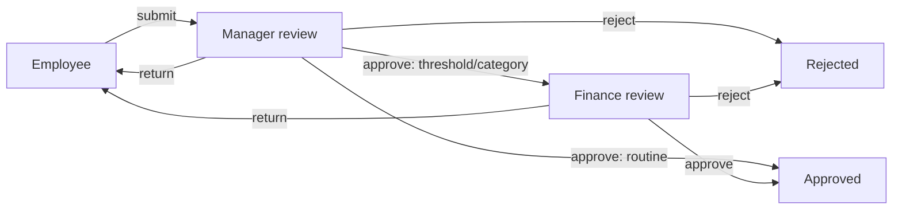

# ApprovalFlow

ApprovalFlow is a local-first internal purchasing application built as a .NET modular monolith. Its React workflow authenticates employees, managers, and finance administrators against the ASP.NET Core API, enforces ownership and reviewer roles, routes deterministic approvals, records an audit trail, and rejects stale writes with SQL Server optimistic concurrency.

## How it works

An employee drafts and submits a purchase request. A manager can approve, reject, or return it; requests of at least $1,000 and Software or Security purchases continue to a finance administrator. Each decision is authenticated, authorized, concurrency-protected, and appended to the audit history. The API transaction writes the request, audit entry, and versioned outbox message together; a Worker later publishes and projects that activity through the local Azure Service Bus emulator.

Primary technologies: .NET 10, ASP.NET Core, EF Core, SQL Server, React 19, TypeScript, Azure Service Bus SDK plus local emulator, Docker Compose, OpenTelemetry/Aspire, xUnit, Vitest, Playwright, and GitHub Actions.



## One-command local start

Requirements: .NET 10 SDK, Docker with Docker Compose, and Node.js 24 LTS with npm.

```bash
./scripts/start-local.sh
```

This starts SQL Server, Microsoft's local Azure Service Bus emulator and its SQL Edge dependency, the API, Worker, built React SPA, and standalone Aspire dashboard. The SPA is at `http://localhost:5173`, OpenAPI at `http://localhost:5080/openapi/v1.json`, health at `/health/live` and `/health/ready`, and local telemetry at `http://localhost:18888`.

Stop only this Compose project, preserving its development volumes:

```bash
./scripts/stop-local.sh
```

No Azure account, tenant, subscription, namespace, payment method, paid service, or live deployment is used. The emulator is a local development/test boundary and its broker storage is intentionally non-persistent.

All published development endpoints bind only to IPv4 loopback (`127.0.0.1`). They are intended for access from the local machine, not from a LAN or the internet.

### Local-only demo accounts

These seeded credentials are non-sensitive demonstration data. They must never be reused or deployed:

| Account | Roles | Password |
|---|---|---|
| `employee.demo@local.test` | Employee | `LocalOnly!2026` |
| `employee2.demo@local.test` | Employee | `LocalOnly!2026` |
| `manager.demo@local.test` | Employee, Manager | `LocalOnly!2026` |
| `finance.demo@local.test` | FinanceAdministrator | `LocalOnly!2026` |

The manager has the Employee role as well so the local workflow can demonstrate the defense against approving one's own request.

### Login and authenticated requests

Login uses ASP.NET Core Identity's built-in local bearer-token endpoint:

```bash
curl -X POST 'http://localhost:5080/api/auth/login' \
  -H 'Content-Type: application/json' \
  -d '{"email":"employee.demo@local.test","password":"LocalOnly!2026"}'
```

Copy the returned `accessToken` into a shell variable:

```bash
EMPLOYEE_TOKEN='<accessToken>'
```

Create a request. Requester identity is derived from the bearer token; no requester field is accepted:

```bash
curl -X POST http://localhost:5080/api/purchase-requests \
  -H "Authorization: Bearer $EMPLOYEE_TOKEN" \
  -H 'Content-Type: application/json' \
  -d '{"vendor":"Northwind Office Supply","costCenter":"ENG-100","category":"Software","businessJustification":"Development tooling for the engineering team.","requestedDeliveryDate":"2030-01-15","lineItems":[{"description":"Tool license","quantity":2,"unitPrice":600.00}]}'
```

Every mutation accepts the current response's base64 `rowVersion`. A stale value returns `409 application/problem+json`:

```bash
curl -X POST http://localhost:5080/api/purchase-requests/{id}/submit \
  -H "Authorization: Bearer $EMPLOYEE_TOKEN" \
  -H 'Content-Type: application/json' \
  -d '{"rowVersion":"<current-rowVersion>","reason":"Ready for manager review"}'
```

Login as the manager, then approve. A $1,200 Software request routes to finance:

```bash
curl -X POST 'http://localhost:5080/api/auth/login' \
  -H 'Content-Type: application/json' \
  -d '{"email":"manager.demo@local.test","password":"LocalOnly!2026"}'

MANAGER_TOKEN='<accessToken>'

curl -X POST http://localhost:5080/api/purchase-requests/{id}/approve \
  -H "Authorization: Bearer $MANAGER_TOKEN" \
  -H 'Content-Type: application/json' \
  -d '{"rowVersion":"<current-rowVersion>","reason":"Manager approved"}'
```

The same reviewer endpoint supports `approve`, `reject`, and `return`. Reject and return require a reason. Returned requests must be revised with `PUT /api/purchase-requests/{id}` before the employee can resubmit.

Set `ConnectionStrings__ApprovalFlow` to override the non-secret development connection string. The Compose password and demo-user password are local demonstration values only.

## Authorization and workflow

- Employees create, view, revise, and submit only requests they own.
- Managers can view submitted/reviewed requests and act only during manager review.
- Finance administrators can view finance-relevant requests and act only during finance review.
- Employees cannot approve, reject, or return requests. The aggregate also prohibits any requester from deciding their own request.
- Submission moves `Draft` to `PendingManagerApproval`.
- Manager approval moves to `Approved`, except totals of at least `$1,000` or categories `Software`/`Security`, which move to `PendingFinanceApproval`.
- Finance approval moves `PendingFinanceApproval` to `Approved`.
- An eligible manager or finance administrator can reject or return with a required reason.
- Revision moves `ReturnedForChanges` back to `Draft`; only then can it be resubmitted.
- Each material change records authenticated actor, timestamp, prior state, new state, and reason.

## Architecture

- `ApprovalFlow.Domain`: aggregate, line items, explicit states, transition and self-approval rules, audit entries.
- `ApprovalFlow.Application`: authenticated use-case orchestration, role/resource checks, and API result contracts.
- `ApprovalFlow.Infrastructure`: ASP.NET Core Identity and application persistence in one SQL Server database, migrations, row-version concurrency, and local demo seed.
- `ApprovalFlow.Api`: local bearer authentication, HTTP/OpenAPI endpoints, validation, and RFC Problem Details.
- `ApprovalFlow.Web`: Vite React/TypeScript SPA, session-scoped authentication, role workspaces, accessible request forms, and the Playwright lifecycle runner.
- `ApprovalFlow.Domain.UnitTests`: focused transition and policy tests.
- `ApprovalFlow.Api.IntegrationTests`: SQL Server-backed authentication, authorization, workflow, audit, and concurrency tests.

The SPA keeps server data in component state and uses a small typed fetch layer; it has no generalized client state/query framework. The bearer access token is stored only in browser `sessionStorage`. Refresh tokens are not retained. Logout clears the token locally, and there is no registration UI.

Three explicit server-scoped list endpoints prevent callers from changing a query parameter to broaden access:

- `GET /api/purchase-requests/mine` derives the owner from the bearer principal and supports status filtering.
- `GET /api/purchase-requests/manager-queue` always returns pending manager work and requires the Manager role.
- `GET /api/purchase-requests/finance-queue` always returns pending finance work and requires the FinanceAdministrator role.

All lists use bounded page sizes (maximum 50) and deterministic sorting. See [`docs/architecture.md`](docs/architecture.md) for the UI/API boundaries and concurrency behavior.

### Asynchronous operations

Every successful workflow transition adds one explicit versioned integration event to `OutboxMessages` in the same SQL Server `SaveChanges` call as the request and audit update. The API never publishes directly, so a broker outage cannot roll back an already committed transition. The Worker polls recoverable pending rows, publishes them with their durable message ID and correlation ID, and marks them published only after Service Bus accepts them.

The Worker consumes the same queue with manual settlement. It creates a local activity projection visible from `GET /api/purchase-requests/{id}/activity` and records the message ID in `ProcessedMessages` in the same database commit. Duplicate deliveries are completed without repeating the projection. Dispatch failures use bounded exponential backoff; after five attempts the outbox row retains its error and durable failed timestamp. Consumer poison messages are retried at most five times, recorded in `FailedBrokerMessages`, and moved to the broker dead-letter subqueue.

`X-Correlation-ID` is accepted when it contains a bounded safe value; otherwise the API creates one. The value is returned to the caller and propagated through the outbox row, broker message, Worker log scope, trace attributes, and activity projection.

Health endpoints:

- `GET /health/live` reports process liveness without probing dependencies.
- `GET /health/ready` independently probes SQL Server and the Service Bus queue and reports unavailable dependencies as not ready.

OpenTelemetry exports ASP.NET Core traces/metrics plus custom API transition, outbox dispatch, consumer, duplicate, failure, and dead-letter signals to the local Aspire dashboard. Structured logs contain message/event/correlation properties. No Application Insights or cloud telemetry backend is configured.

The emulator is pinned to Microsoft's `2.0.0` container and uses its required local SQL Edge `2.0.0` dependency. Queue entities are declared before startup in [`infrastructure/servicebus/Config.json`](infrastructure/servicebus/Config.json), because the emulator does not support SDK management operations. The emulator's broker data is not persistent across restarts; the SQL outbox and processed-message records are durable, so unpublished work remains recoverable.

## Frontend and end-to-end tests

```bash
cd src/ApprovalFlow.Web
npm ci
npm run lint
npm test
npm run build
npx playwright install chromium
npm run e2e
```

`npm run e2e` requires the Compose SQL Server to be healthy. It creates a unique database named `ApprovalFlowE2E_<GUID>`, starts the real API and SPA, and runs the primary workflow without API mocks. Its `finally` cleanup validates the exact database name, drops only that database, and verifies removal. On hosts missing Chromium system libraries, the runner uses the version-pinned official Playwright browser-server image; the container is ephemeral and uses host networking only for the local test servers.

## Validation

With Compose infrastructure running:

```bash
dotnet restore ApprovalFlow.slnx
dotnet build ApprovalFlow.slnx --no-restore
dotnet test ApprovalFlow.slnx --no-build
dotnet format ApprovalFlow.slnx --verify-no-changes --no-restore
cd src/ApprovalFlow.Web
npm ci
npm run lint
npm test
npm run build
npx playwright install chromium
npm run e2e
cd ../..
git diff --check
docker compose config --quiet
```

The same application validation runs in [GitHub Actions](.github/workflows/ci.yml), including real SQL Server and Service Bus emulator integration tests and Playwright. Testcontainers adds an opt-in isolated SQL migration/seed test (`APPROVALFLOW_TESTCONTAINERS=true`) while the established Compose boundary remains authoritative for emulator tests.

For clean-checkout review, media refresh, operations/security notes, and the 15-item evidence map, see [`docs/clean-checkout.md`](docs/clean-checkout.md), [`docs/media.md`](docs/media.md), [`docs/operations.md`](docs/operations.md), [`docs/security-privacy.md`](docs/security-privacy.md), and [`docs/public-readiness-checklist.md`](docs/public-readiness-checklist.md).

## License

ApprovalFlow is available under the [MIT License](LICENSE).
