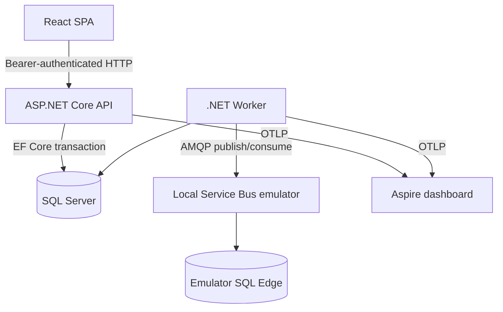
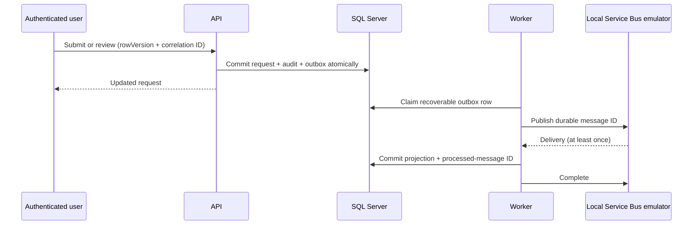

# ApprovalFlow architecture

## Runtime shape

ApprovalFlow remains one modular monolith: a React/TypeScript SPA, one ASP.NET Core API, one Worker Service, and one SQL Server application database. During development, Vite serves the SPA and proxies `/api` to the API. The SPA does not connect to SQL Server and does not reproduce workflow authorization rules.

The backend projects retain their existing responsibilities:

- Domain owns request state transitions, finance-routing policy, self-approval prevention, and audit creation.
- Application owns authenticated use cases and role/resource authorization.
- Infrastructure owns Identity and EF Core SQL Server persistence.
- API owns HTTP contracts, bearer authentication, validation, and Problem Details.
- Web owns interaction state, accessible forms and tables, and presentation of server results.
- Worker owns outbox dispatch and explicit integration-event consumption.

## Transactional messaging

Workflow mutation, audit creation, and outbox creation share one EF Core unit of work and one SQL Server transaction. Broker I/O is deliberately outside the API transaction. The Worker publishes `approvalflow.purchase-request.submitted.v1`, `reviewed.v1`, `returned.v1`, and `revised.v1` contracts to one local queue using the outbox ID as the broker message ID.

At-least-once delivery is intentional. A publish can succeed before the SQL published marker is saved, so broker duplicate detection and the consumer's durable `ProcessedMessages` primary key both use the message ID. The projection and processed marker commit together. Bounded dispatcher failures become durable failed outbox rows; bounded consumer failures become SQL failure records and Service Bus dead letters.

The official local Azure Service Bus emulator has its own required SQL Edge container. That database is an emulator implementation detail, not an ApprovalFlow service database. Emulator messages do not persist after a restart; the application SQL outbox remains the recovery authority.

## Operational signals

The API and Worker export local OTLP traces and metrics to the standalone Aspire dashboard. Correlation flows from the HTTP header through outbox and broker metadata into Worker spans and the activity projection. `/health/live` checks only the API process; `/health/ready` probes application SQL and messaging separately.

## Authentication and authorization

The login form calls ASP.NET Core Identity's bearer-token endpoint. It stores only `accessToken` in `sessionStorage`, then calls the authenticated `/api/auth/session` endpoint to obtain the current user name and roles. It does not retain the returned refresh token, use local storage, expose registration, or accept a requester identity from the browser.

The SPA hides actions that do not match the active role, but the API remains authoritative. Detail authorization uses the existing resource checks. Lists use three fixed scopes rather than a caller-selected scope:

| Endpoint | Server-enforced scope |
|---|---|
| `/api/purchase-requests/mine` | Authenticated employee's user name |
| `/api/purchase-requests/manager-queue` | `PendingManagerApproval`, Manager role |
| `/api/purchase-requests/finance-queue` | `PendingFinanceApproval`, FinanceAdministrator role |

Pagination is one-based, page size is limited to 1–50, and sorting is restricted to last-modified or total in ascending/descending order with request ID as a deterministic tie-breaker. This is a bounded request-list feature, not a generalized query framework.

## Browser workflow

Employees can filter and page through owned requests, create a draft with one or more line items, inspect details and audit history, submit, and revise/resubmit a returned request. Managers and finance administrators have separate pending queues and can approve, reject, or return eligible requests. Reject and return require a reason in both the UI and API.

Each update sends the latest base64 `rowVersion` returned by the API. A `409` is never retried automatically: the UI presents the Problem Details message and an explicit reload action. Reloading discards the stale representation and obtains a current row version before the user chooses whether to act again.

## Testing boundary

Vitest covers session-only token persistence and typed Problem Details/concurrency handling. The Playwright workflow runs against the real API and a uniquely named SQL Server database. The lifecycle runner validates the `ApprovalFlowE2E_<32 lowercase hex characters>` name before any drop, terminates its exact ephemeral browser container, drops only that database, and queries `master` to verify removal. Traces, videos, and screenshots are retained only on failure.

Testcontainers is deliberately limited to an opt-in SQL Server migration/seed isolation test. It proves clean-machine container allocation without rewriting the reliable, exact-name database factory or pretending the Service Bus emulator is a single-container dependency. Compose remains the representative integration boundary for SQL Server, SQL Edge, the real emulator, and asynchronous failure behavior.

## Tradeoffs and intentional non-goals

- A modular monolith keeps transactions and authorization understandable; this is not microservices.
- At-least-once delivery requires durable idempotency instead of distributed transactions.
- Local Identity bearer tokens and seeded accounts make review reproducible; they are not a production identity design.
- The emulator improves local fidelity but is explicitly not deployed Azure Service Bus experience.
- The SPA uses a small typed fetch layer instead of a generalized state framework.
- No Kubernetes, event sourcing, generic workflow engine, payment/vendor integration, multi-tenancy, paid cloud service, or live deployment is included.
